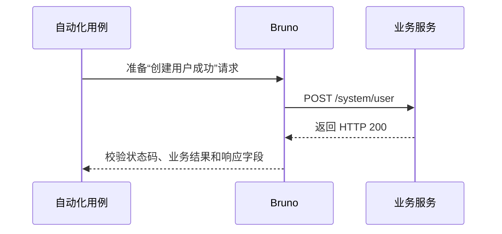

# Modular Coverage Manifest

Use module manifests as the source of truth. The global index is generated from them and is used only for cross-module reconciliation.

## Version Lock

Keep version-lock.yaml at the contracts root. It records the business Git commit against which the Bruno collection was reviewed and executed. A stale lock is not a passing state; classify the changed files, adapt affected modules when needed, then advance the lock.

    version: 1
    business:
      repo: /path/to/business-repository
      commit: abc123...
      ref: main
      impact_review: non-api

The generated global index should also record `generation_status` (`draft`,
`runnable`, `verified`, or `blocked`), the offline contract SHA, inventory
counts, and blocked-module count. `draft` is an expected intermediate state,
not completion evidence.

## module-map.yaml

Map each original Swagger Tag to exactly one stable ASCII module `id`. Keep the
display name unchanged. The generated `directory` is an optional safe path
segment for human-readable artifacts; Chinese Tags use the Chinese name there
while IDs remain stable machine references. Path prefixes and controller names
are review metadata only and never choose ownership:

    modules:
      - id: system-user
        name: 用户管理
        directory: 用户管理
        business_scope: 用户账号的创建、查询、修改、删除和状态维护
        swagger_tags:
          - sys-user-controller
      - id: system-role
        name: 角色管理
        directory: 角色管理
        swagger_tags:
          - sys-role-controller

If an operation declares more than one Tag, add an explicit `primary_tags`
mapping keyed by endpoint ID, `operationId`, or `METHOD /path`. An operation
without a Tag must have an explicit `operation_ids`, `path_prefixes`, one
`default: true` module, or a single-module map; an unresolved owner remains
blocked. Do not use URL prefixes when an operation already declares a Tag.

## Module endpoints.yaml

Each module owns its endpoint inventory:

    version: 1
    module: system-user
    source:
      openapi_file: contracts/openapi.json
    endpoints:
      - id: USER_CREATE
        method: POST
        path: /system/user
        operation_id: addUser
        case_ids:
          - USER_CREATE_OK
          - USER_CREATE_DUPLICATE
          - USER_CREATE_NO_TOKEN

Each module also owns `parameters.yaml`, `definitions.yaml`, and
`responses.yaml`. These files contain only data referenced by that module's
endpoints; shared OpenAPI components are copied into each owning module rather
than read from a global mutable manifest.

## request-auth.yaml

Select exactly one request pre-request mode. The generated default enables the
`seres-sign` mode; `seres.sign: true` is accepted as an alias. All `*_env`
values are environment variable names, not secrets. The signature inputs and
output Header names are configurable while preserving the default SHA-256
contract:

    version: 1
    mode: seres-sign
    seres-sign: true
    # seres.sign: true
    base_url_env: BASE_URL
    modes:
      seres-sign:
        enabled: true
        algorithm: SHA256
        secret_key_env: SECRET_KEY
        access_key_env: ACCESS_KEY
        signature:
          parameters:
            url: request.path
            body: request.body
            query: request.query
            timestamp: timestamp
            secret_key_env: SECRET_KEY
            access_key_env: ACCESS_KEY
          append_secret: true
        headers:
          sign: sign
          timestamp: timestamp
          accesskey: accesskey
        extra_headers:
          # X-Tenant-Id: TENANT_ID
      bearer:
        enabled: false
        token_env: ACCESS_TOKEN
        header: Authorization
      api-key:
        enabled: false
        token_env: API_KEY
        header: X-API-Key
      custom:
        enabled: false
        headers:
          X-Service-Token: SERVICE_TOKEN

`BASE_URL`, credential variables, and token variables are read from the Bruno
environment. Never put their values in a manifest or `.bru` file.

For `seres-sign`, `signature.parameters.url` accepts `request.path` (the
default) or `request.url`; `body` and `query` can be set to `false` to omit
those inputs.
The currently implemented digest is `SHA256`; an unsupported algorithm is
rejected instead of silently producing a different signature. Custom Header
values may be plain environment names or `{env: NAME, prefix: Bearer}` objects.

## Request and response payloads

Cases may declare `request.body_type` or `request.content_type`. The Bruno
materializer maps these values to `body:json`, `body:xml`, `body:text`,
`body:form-urlencoded`, `body:multipart-form`, `body:graphql`, or
`body:file`. JSON remains the default when no type is declared. Multipart
file fields use `{file: path}` or an `@path` value and must be supplied through
an environment/fixture rather than committing credentials or private files.

Assertions can target `$.data.id` JSON paths, `target: text`/`body_text` for
raw text/XML/binary body content, `target: header` with a response header name, or
`target: cookie` with a cookie name. `expected.business_code_path` overrides
the default `$.code` location when an application uses a different envelope.

## Module cases.yaml

Cases link back to an endpoint and optionally to source logic. Assertions must include a concrete field or relation beyond status and business code:

    version: 1
    module: system-user
    cases:
      - id: USER_CREATE_OK
        title: 创建用户成功
        description: 验证合法用户资料能够创建成功并返回新用户信息。
        endpoint_id: USER_CREATE
        scenarios:
          success: {applicable: true}
          authentication: {applicable: true}
          validation: {applicable: true}
          authorization: {applicable: false, reason: "endpoint has no role or tenant guard"}
        logic_ids:
          - USER_CREATE_NORMAL_LOGIC
        bru: create-success.bru
        expected:
          http_status: 200
          business_code: 0
        assertions:
          - path: $.data.userName
            equals: "{{user_name}}"
          - path: $.data.userId
            exists: true

      - id: USER_CREATE_DUPLICATE
        title: 用户名重复时创建失败
        description: 验证重复用户名被业务规则拒绝并返回明确提示。
        endpoint_id: USER_CREATE
        logic_ids:
          - USER_CREATE_DUPLICATE_LOGIC
        bru: create-duplicate.bru
        expected:
          http_status: 200
          business_code: 601
        assertions:
          - path: $.msg
            contains: "已存在"

Do not create two case records with the same
`endpoint_id + scenario + request + assertions` fingerprint. A different case
ID does not make an identical request/assertion pair independent coverage.

`bru`/`file_name` may explicitly choose a filename. When omitted, the draft
materializer uses a Chinese `display_name`, `name`, `title`, endpoint `summary`,
or module directory when one is available, and adds a deterministic short hash
to avoid collisions. English IDs remain in `meta.name` and manifests.

## contracts/README.md and module CASES.md

The parser generates `contracts/README.md` as the business-facing module
overview. It must contain every Tag module, its business scope, included
contract artifacts, endpoint inventory, and a link to the module's `CASES.md`.
Keep this overview aligned with `module-map.yaml` and `index.yaml`.

Each module owns one `CASES.md`. It describes the module's business scope,
owned manifests, endpoints, and every automated case. Each case is keyed by
its stable case ID and contains a title, one short business description, and a
Mermaid swimlane. Use Chinese wording when the source Tag, endpoint summary,
validation message, or source comment is Chinese:

````markdown
<!-- CASE_START: USER_CREATE_OK -->
### 创建用户成功

简短描述：验证合法用户资料能够创建成功并返回新用户信息。


<!-- CASE_END: USER_CREATE_OK -->
````

Run `materialize_missing_bru.py` after changing `cases.yaml`; it updates the
generated case section without replacing manual module notes. The coverage
checker rejects a missing contracts README, missing module document, unknown
or duplicate documented case ID, or a case block without its title, brief
description, and sequence diagram.

If decisions are shared by multiple cases, put the matrix on the endpoint
instead of repeating it on every case:

```yaml
      - id: USER_CREATE
        method: POST
        path: /system/user
        scenario_matrix:
          success: {applicable: true}
          authentication: {applicable: true}
          authorization: {applicable: false, reason: "no role/tenant guard"}
          validation: {applicable: true}
          business_error: {applicable: true}
          query: {applicable: false, reason: "not a query operation"}
          safety: {applicable: false, reason: "no idempotency contract"}
          file: {applicable: false, reason: "not a file operation"}
```

Run the coverage checker with `--require-scenarios` at the completion gate;
it accepts either this endpoint-level form or per-case `scenarios` entries.

## Module logic.yaml

    version: 1
    module: system-user
    logic:
      - id: USER_CREATE_NORMAL_LOGIC
        source: SysUserService.insertUser
        condition: username is unique and required data is valid
        case_ids:
          - USER_CREATE_OK
      - id: USER_CREATE_DUPLICATE_LOGIC
        source: SysUserService.insertUser
        condition: username already exists
        case_ids:
          - USER_CREATE_DUPLICATE

## Module flows.yaml

    version: 1
    module: system-user
    flows:
      - id: USER_CRUD_FLOW
        steps:
          - operation: create
            case_id: USER_CREATE_OK
            capture: user_id
          - operation: update
            case_id: USER_UPDATE_OK
            uses: user_id
          - operation: query
            case_id: USER_QUERY_AFTER_UPDATE
            uses: user_id
          - operation: delete
            case_id: USER_DELETE_OK
            uses: user_id
          - operation: query
            case_id: USER_QUERY_AFTER_DELETE
            uses: user_id
            assert_absent: user_id

The module or endpoint must explicitly declare `flow_required: true` (or a
non-empty `flow_kind`) before this flow is required. HTTP method alone does not
require a flow: login, search, calculation, command, webhook, and event
endpoints are valid isolated cases. If a flow-required module does not expose
one operation, omit that step and record the missing capability in the module
exclusions file.

An empty `flows.yaml` is only valid for a module with no explicitly
flow-required endpoint, or with an approved exclusion containing both a reason
and a cleanup/reset plan. A pending exclusion keeps the manifest reviewable but
cannot make the completion gate pass.

## Global index.yaml

Generate this file; do not hand-edit it:

    version: 1
    generation_status: draft
    inventory_endpoints: 30
    generated_cases: 0
    blocked_modules: 0
    source:
      openapi_file: contracts/openapi.json
      swagger_sha256: ...
    modules:
      - id: system-user
        name: 用户管理
        swagger_tag: sys-user-controller
        endpoints_file: modules/system-user/endpoints.yaml
        parameters_file: modules/system-user/parameters.yaml
        definitions_file: modules/system-user/definitions.yaml
        responses_file: modules/system-user/responses.yaml
        documentation_file: modules/system-user/CASES.md
        cases_file: modules/system-user/cases.yaml
        endpoint_count: 18
        case_count: 72
      - id: system-role
        endpoints_file: modules/system-role/endpoints.yaml
        cases_file: modules/system-role/cases.yaml
        endpoint_count: 12
        case_count: 48

The global checker compares the union of module endpoints with the offline Swagger inventory and verifies that every endpoint, logic path, case, and flow is accounted for.

The checker should also reject duplicate IDs, duplicate case-to-file mappings, unregistered Bruno files, unknown case endpoint references, and missing scenario decisions when strict matrix validation is enabled. Pass the saved offline document explicitly (`--openapi contracts/openapi.json`) so a manifest cannot validate against itself.
