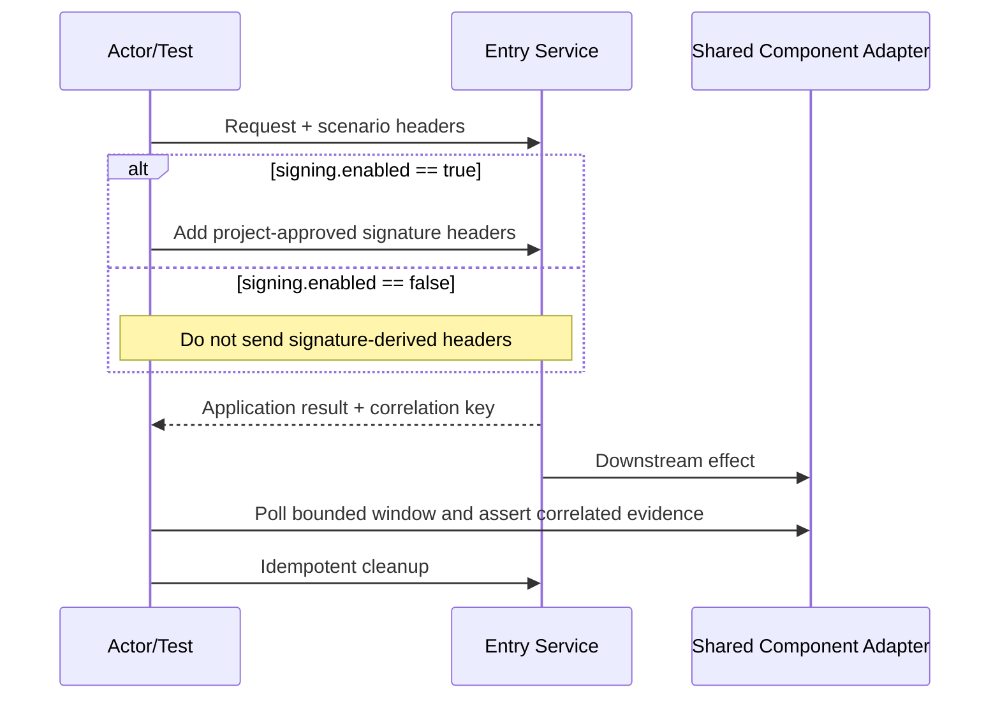

# Scenario Artifact Policy

Use a scenario-first layout so a reviewer can understand and run one business
journey without searching unrelated modules. The directory named by the
scenario's `artifact_dir` is the ownership boundary for non-public artifacts.

## Required layout

```text
scenarios/<SCENARIO_ID>/
  test_<business_flow>.py       # pytest entrypoint, business intent visible
  README.md                     # purpose, preconditions, config source, run command
  swimlane.md                   # required Mermaid diagram
  docs/                         # materialized templates and detailed scenario docs
  data/                         # request/fixture/expected data owned by this scenario
  scripts/                      # setup/verification helpers owned by this scenario
```

`data/` and `scripts/` are created only when needed, but scenario-specific
payloads, seed data, SQL, messages, snapshots, and one-off utilities must stay
inside this directory. Do not put them in a global `fixtures/` or `scripts/`
directory. The only root-level scripts allowed are project-wide reconciliation,
CI, or packaging tools; they must not contain scenario-specific data or logic.
A scenario-local `conftest.py` is allowed for scenario-owned fixtures;
project-wide fixtures belong in the shared fixture area.

Any skill reference used by a generated scenario must be copied into its
`docs/` directory (or an explicitly shared `common/docs/` directory after a
second scenario reuses the same contract). Generated plans must point to that
materialized project path, never to a path that exists only inside the skill
repository.

## Shared versus scenario code

- Shared modules contain only reusable transport clients, header/signing
  middleware, generic MySQL/Kafka/EMQ/Redis adapters, and scope-safe fixtures.
  They must accept project configuration and mappings instead of embedding a
  business scenario.
- Scenario modules contain actor actions, business assertions, correlation
  values, polling predicates, scenario data, cleanup, and explanatory docs.
  Keep the scenario ID in pytest markers, test names, logs, and reports.
- Do not extract a helper merely to shorten one scenario. Extract only when the
  behavior is truly public/reused and document its ownership and lifecycle.

When signing is enabled, ordinary request-header overrides are applied before
the signer. The signer owns and writes its reserved headers last; disabled
signing removes those names from the final request.

## Swimlane requirement

Every scenario includes `swimlane.md` with a Mermaid `sequenceDiagram` (or an
equivalent project-approved swimlane format). The diagram must show:

1. actor/test runner and every service boundary;
2. request headers and an `alt` branch for signing enabled/disabled when signing
   is part of the contract;
3. enabled component observers (MySQL, Kafka, EMQ/EMQX, Redis, jobs, etc.);
4. correlation ID/business key propagation, bounded polling, checkpoints, and
   cleanup ownership.

Do not draw a disabled component as an active participant or checkpoint; a
short note may record that it was intentionally disabled.

Minimal shape:



The diagram is documentation, not a substitute for executable checkpoints.
Update it whenever services, headers, enabled components, or cleanup change.

## Chinese comments and documentation

Generated Python uses Chinese comments/docstrings for module purpose, fixture
scope, configuration sources, header precedence, signing branches, business
steps, correlation, polling deadlines, redaction, and cleanup. Comments should
explain why a boundary or ownership rule exists; do not pad trivial assignments.
`README.md` and failure diagnostics should likewise explain the scenario in
Chinese unless the business project explicitly requires another language.
