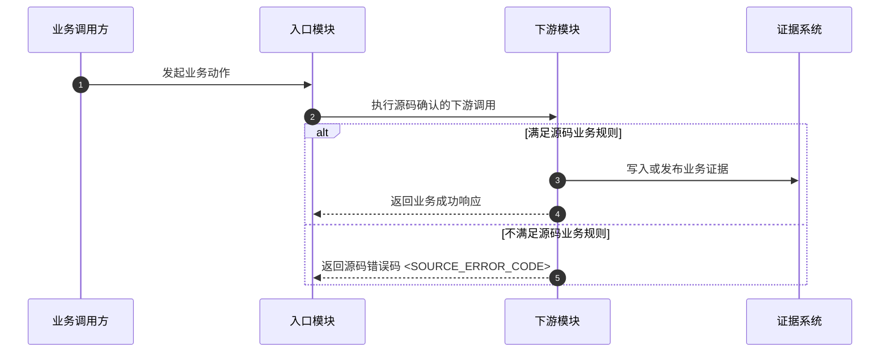

# Scenario Artifact Policy

Each Chinese-named directory under `scenarios/` owns one complete business journey. A reviewer can understand, collect, run, and maintain it without a global scenario list.

## Required layout

```text
scenarios/<中文业务名称>/
  场景定义.yaml
  业务数据.json
  业务流程图.md
  test_<中文业务名称>.py
```

Add `自动化测试流程图.md` only when executable orchestration materially differs from the business flow. For a long scenario, add only the scenario-owned modules that improve readability:

```text
步骤.py    场景动作编排
断言.py    场景专属业务断言
清理.py    场景专属幂等清理
```

Do not generate narrative scenario files, version-history files, placeholder modules, or a global manifest. Put purpose, preconditions, key steps, and outcomes before the business diagram. Keep source commits, anchors, control matrix, and generation ownership in `场景定义.yaml`; Git provides history.

When migrating an existing project, preserve useful intent in the diagram introduction and migrate to the schema in [e2e-workflow.md](e2e-workflow.md). Remove superseded files only under explicit migration authorization; do not maintain dual readers or silently migrate during an unrelated update.

## Ownership boundary

A scenario subagent may create or modify only its assigned `scenarios/<中文业务名称>/` directory. It must not edit `common/`, `config/`, `scripts/`, discovery artifacts, another scenario, or project dependency files. It reports requested common changes to the main agent with source anchors and intended call sites. The main agent decides whether reuse is real, applies shared changes, and checks cross-scenario isolation.

The `generation.write_scope` field must equal the scenario directory exactly. The checker compares the declared scope with the scenario location and validates multi-scenario ownership rules. This metadata records generation responsibility; it does not authorize a runtime side effect.

## Test entrypoint

Keep `test_*.py` as readable orchestration. The shape below is illustrative; replace names and marker content with scenario-derived values:

```python
"""编排当前目录定义的业务端到端场景。"""

import pytest


@pytest.mark.business_e2e
@pytest.mark.scenario_id("<STABLE_SCENARIO_ID>")
def test_业务链路(scenario_context):
    """验证源码定义的业务动作、下游证据和恢复结果。"""
    preflight(scenario_context)
    record_business_entry(scenario_context)

    try:
        # 资源一旦创建，立即注册幂等清理，避免后续失败遗留数据。
        result = perform_business_action(scenario_context)
        register_cleanup(scenario_context, result)
        assert_business_response(result)

        # 异步证据使用有限等待并输出最后一次观察结果。
        evidence = wait_for_correlated_evidence(scenario_context, result)
        assert_business_outcome(evidence)
    finally:
        restore_scenario_state(scenario_context)
```

Angle-bracket values are metavariables, not literal generated identifiers. The stable ID appears outside the definition only in exactly one pytest marker. Do not copy it into directory names, filenames, headings, logs, or indexes.

## Business flow diagram

`业务流程图.md` starts with a short business statement and concise numbered steps, then uses an RCP-style Mermaid `sequenceDiagram`. Use only discovered actors and source-backed branches:

````markdown
# <中文业务名称>

本图说明源码确认的业务入口、跨模块处理、可观测结果和异常分支。

关键步骤：

1. 调用公共业务入口。
2. 关联下游处理证据。
3. 验证最终业务结果。
4. 恢复场景拥有的数据。


````

Replace every participant, call, condition, and error code with source evidence. Never copy the generic labels as if they were discovered facts. If a modeled failure code cannot be confirmed, keep the scenario `contract_blocked` rather than inventing one.

Diagram rules:

- Use `sequenceDiagram`, never a flowchart.
- Arrange participants horizontally and progression vertically.
- Use Chinese business names or discovered service/module IDs.
- Use paired `alt`/`else` only for real source branches.
- Include the exact source-confirmed business error code for modeled failure branches.
- Exclude pytest, fixtures, observer setup, polling implementation, and Python function names.

Every other generated graphic follows the same business-oriented style. A topology, microservice-interaction, or automation view may use Mermaid `sequenceDiagram` or `flowchart`, but stays at the level of business stages, services/modules, external systems, evidence, and recovery. It must not expand method calls, classes, Python functions, line-level conditions, pytest fixtures, or polling implementation. Do not generate class, entity-relationship, state-machine, mind-map, chart, or decorative diagrams for an E2E scenario.

Create `自动化测试流程图.md` only for meaningful orchestration such as pre-subscription, offset capture, multiple evidence sources, authorized time control, or non-trivial restoration. It may show high-level runner and observer roles, but actions remain business-oriented.

## Data and code ownership

- `业务数据.json` owns environment-isolated business inputs. Source-valid literals and constructible synthetic templates stay literal; exact placeholders are reserved for environment-owned data that cannot be created safely. A referenced data subtree made entirely of placeholders is invalid.
- `common/builders/` owns explicitly mapped payload construction reused by multiple scenarios.
- `common/repositories/` owns reusable parameterized read-only queries and stable row mapping.
- `common/controls/` owns reusable authorized and reversible controls; it is never imported by scenarios that do not declare those controls.
- `common/assertions/` owns reusable protocol and cross-system assertions.
- Scenario modules own scenario-only actions, mappings, assertions, cleanup, and restoration verification.
- `test_*.py` owns only preflight, orchestration, assertions, and guaranteed cleanup.

Every Python module, class, and function has a concise Chinese docstring. Add Chinese comments before non-obvious business branches, bounded waits, safety checks, and cleanup. Preserve source and protocol identifiers only where the current scenario actually discovered them.

## Mapping, proof, and cleanup

Inspect source DTOs, schemas, or offline API descriptions before implementing a builder. Explicitly map every field, nesting rule, unit, enum representation, and time format. Never pass a loaded business-data mapping wholesale into a request model or payload.

Every request that can create, update, cancel, publish, trigger, or otherwise mutate first validates transport and the source-defined business response. Only then may the test poll downstream evidence.

Prove the requested transition through direct state, an operation record, a correlated message, or persistence evidence. Finding a resource or correlation key proves identity only. Observers start before the action and use bounded deadlines.

Register idempotent cleanup immediately after acquiring each resource. Cleanup failures are always reported. When the test body has already failed, keep that original exception primary and attach cleanup/restoration failure as secondary evidence. The finalizer verifies restoration rather than assuming that a cleanup call succeeded.
