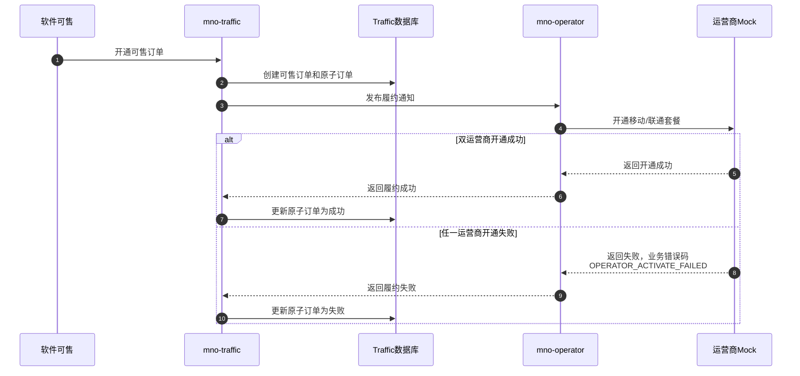

# Scenario Artifact Policy

Each Chinese-named directory under `scenarios/` owns one complete business journey. A reviewer should be able to understand, collect, run, and maintain it without a global scenario list.

## Required layout

```text
scenarios/<中文业务名称>/
  场景定义.yaml
  业务数据.json
  业务流程图.md
  test_<中文业务名称>.py
```

Add `自动化测试流程图.md` only when executable orchestration materially differs from the business flow. For a long scenario, add only the scenario-owned modules that improve readability:

```text
步骤.py    场景动作编排
断言.py    场景专属业务断言
清理.py    场景专属幂等清理
```

Do not generate `场景说明.md`, `版本变更记录.md`, placeholder modules, or a global manifest. Put the former scenario explanation into the introduction of `业务流程图.md`; keep source commits and anchors in `场景定义.yaml`, with history provided by Git.

Apply the YAML comment rules in [e2e-workflow.md](e2e-workflow.md) to `场景定义.yaml`. `业务数据.json` is strict JSON keyed by environment and contains neither comments nor synthetic comment fields. Preserve business meaning, units, enums, association keys, and placeholder provenance through source-confirmed field names, builders, environment configuration, and focused tests.

When migrating an existing scenario, first preserve its useful purpose, preconditions, and outcome text in the business-diagram introduction, then delete `场景说明.md`. Move the reviewed source baseline and anchors into `source`, then delete `版本变更记录.md`; Git retains its prior contents. Delete an existing automated-test diagram only when it adds no material orchestration beyond the updated business diagram.

Under explicit authorization to migrate a generated E2E project, convert `业务数据.yaml` once into environment-keyed `业务数据.json`, update every `data_ref`, validate all environment paths, and then remove the old file. Do not keep dual YAML/JSON readers or silently migrate an existing project during an unrelated update.

The stable ID appears only in `场景定义.yaml` and exactly one pytest marker:

```python
"""编排实名双运营商续订业务场景。"""

import pytest


@pytest.mark.scenario_id("MNO_REALNAME_DUAL_OPERATOR_RENEWAL")
def test_实名双运营商续订(scenario_context):
    """验证实名、双运营商履约、阈值续订和跨月续订。"""
    run_preflight(scenario_context)

    try:
        # 1. 发送实名通知，确保车卡具备履约前置状态。
        send_dual_real_name(scenario_context)

        # 2. 开通可售订单，等待移动和联通原子订单均成功。
        order = activate_and_wait_fulfillment(scenario_context)
        assert_dual_operator_fulfillment(order)
    finally:
        # 断言失败时仍通过业务接口执行幂等清理。
        cleanup_salable_order(scenario_context)
```

Do not copy the stable ID into the directory, filename suffix, function name, headings, logs, or another index.

## Business flow diagram

`业务流程图.md` starts with a short business statement and a concise numbered list of key steps. Then use an RCP-style Mermaid `sequenceDiagram`:

````markdown
# 实名双运营商续订

本图验证实名登记成功后，系统按策略开通移动大包和联通周期套餐，并验证阈值续订、移动达量取消和跨月周期订购。

关键步骤：

1. 发送双运营商实名通知。
2. 开通可售订单并等待履约。
3. 触发双运营商 2G 阈值。
4. 核对 Kafka 与数据库证据。
5. 进入第二个月验证周期订购。


````

Diagram rules:

- Use `sequenceDiagram`, never `flowchart LR` or `flowchart TD`.
- Arrange participants horizontally and business progression vertically.
- Use Chinese business names or explicit service names for participants.
- Use `alt` and `else` for real source-confirmed branches.
- Include the source-confirmed business error code in every modeled failure branch. Do not invent one; use `contract_blocked` when the required code cannot be established.
- Put only business actors, calls, messages, and state changes in the business diagram. Exclude pytest, fixtures, observer setup, polling implementation, and code-level details.

## Automated test flow diagram

Create `自动化测试流程图.md` only when the test adds meaningful orchestration such as pre-subscription, offset capture, multi-observer reconciliation, time control, or non-trivial cleanup that the business diagram should not show. It also uses `sequenceDiagram` and may show the test runner, observer, and cleanup lifecycle, but uses business actions rather than Python function names.

When the distinction is small, omit this file; do not duplicate the business diagram under another heading.

## Data and Python ownership

- `业务数据.json` owns environment-isolated business inputs and exact placeholders under root environment keys.
- `common/builders/` owns reusable payload construction.
- `common/repositories/` owns reusable read-only SQL and row mapping.
- `common/assertions/` owns reusable protocol and cross-system assertions.
- Scenario modules own scenario-specific actions, assertions, mappings, and cleanup.
- `test_*.py` owns only readable orchestration and guaranteed cleanup.

Every Python module, class, and function has a concise Chinese docstring. Add Chinese comments before business branches, asynchronous waits, and cleanup when intent is not self-evident. Keep protocol fields and source identifiers unchanged.

## Contract mapping and proof

Before implementing a builder, inspect the source DTO or an offline OpenAPI document and map every field explicitly. Preserve source field names on the wire and write deliberate conversions for different JSON names, nesting, units, enum representations, and time formats. Never use `dict(data)`, `payload.update(data)`, `Model(**data)`, or equivalent whole-object pass-through, even when the current names happen to match.

Every request that may create, update, cancel, unsubscribe, fulfill, or publish first validates the transport result and source-defined business response. Only a successful business response permits downstream polling.

Prove cancellation, unsubscription, fulfillment, and message publication with at least one direct state, operation-log, message, or persistence observation justified by the contract trace. Finding the resource or its correlation key proves identity, not the requested state transition.

Register idempotent cleanup immediately after each resource is acquired, before later assertions or polling can fail. Cleanup may log or attach its own exception, but when the test body already failed it must preserve that original exception as the primary failure.
