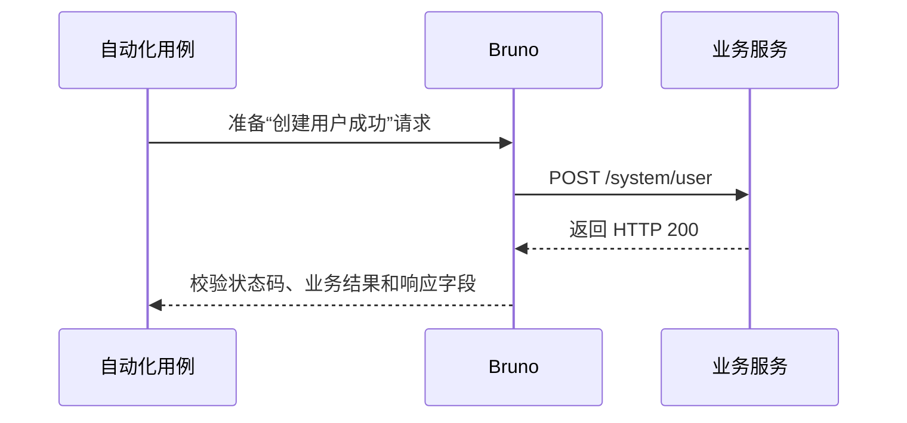

# Modular Coverage Manifest

Use module manifests as the source of truth. The global index is generated from them and is used only for cross-module reconciliation.

## Version Lock

Keep `version-lock.yaml` and `qa-lock.yaml` at the contracts root. The first
records a current-workspace source digest excluding `qa/**`; the second records
OpenAPI, module, case, and generation-state fingerprints. A stale lock is not a
passing state.

    version: 1
    business:
      repo: /path/to/business-repository
      commit: filesystem:0123456789abcdef
      ref: filesystem
      source_digest: 0123456789abcdef...
      impact_review: non-api

The generated global index should also record `generation_status` (`draft`,
`runnable`, `verified`, or `failed`), the offline contract SHA, inventory
counts, failed-module count, and `execution_config_file`. `draft` is an
expected intermediate state, not completion evidence.

`generation-state.yaml` is the incremental generator ledger:

```yaml
version: 1
generator_version: 2.0.0
openapi_sha256: ...
design_sha256: ...
last_generated_at: ...
endpoints: {}
modules: {}
cases: {}
deleted_endpoint_ids: []
manual_review_cases: []
```

See [incremental-generation.md](incremental-generation.md) for update rules.

## module-map.yaml

Map each original Swagger Tag to exactly one stable ASCII module `id`. Keep the
display name unchanged. The generated `directory` is an optional safe path
segment for human-readable artifacts; Chinese Tags use the Chinese name there
while IDs remain stable machine references. Path prefixes and controller names
are review metadata only and never choose ownership:

    modules:
      - id: system-user
        name: 用户管理
        directory: 用户管理
        business_scope: 用户账号的创建、查询、修改、删除和状态维护
        swagger_tags:
          - 用户管理
      - id: system-role
        name: 角色管理
        directory: 角色管理
        swagger_tags:
          - 角色管理

If an operation declares more than one Tag, add an explicit `primary_tags`
mapping keyed by endpoint ID, `operationId`, or `METHOD /path`. An operation
without a Tag must have an explicit `operation_ids`, `path_prefixes`, one
`default: true` module, or a single-module map; an unresolved owner remains
blocked. Do not use URL prefixes when an operation already declares a Tag.

## Module endpoints.yaml

Each module owns its endpoint inventory:

    version: 1
    module: system-user
    source:
      openapi_file: contracts/openapi.json
    endpoints:
      - id: USER_CREATE
        method: POST
        path: /system/user
        operation_id: addUser
        case_ids:
          - USER_CREATE_OK
          - USER_CREATE_DUPLICATE
          - USER_CREATE_NO_TOKEN

Each module also owns `parameters.yaml`, `definitions.yaml`, and
`responses.yaml`. These files contain only data referenced by that module's
endpoints; shared OpenAPI components are copied into each owning module rather
than read from a global mutable manifest.

## execution/config.yaml

This file contains `active_environment`, `tooling`, `coverage_profile`, and a
structured `sign` object. The parser rejects authentication, Header/Cookie,
token/key selector, path rule, and unknown fields. Common Headers live in the active environment's independent
`headers {}` KV block. The CLI resolves its `{{VAR}}` references and injects
every non-empty value from `collection.bru`; request-local Headers have
priority. A negative case can remove a configured Header with:

```yaml
request:
  omit_common_headers:
    - X-Tenant-Id
```

See [execution-config.md](execution-config.md) for the schema, Header format,
signing behavior, execution scope, and script/shared-CLI modes.

## Request and response payloads

Cases may declare `request.body_type` or `request.content_type`. The Bruno
materializer maps these values to `body:json`, `body:xml`, `body:text`,
`body:form-urlencoded`, `body:multipart-form`, `body:graphql`, or
`body:file`. JSON remains the default when no type is declared. Multipart
file fields use `{file: path}` or an `@path` value and must be supplied through
an environment/fixture rather than committing credentials or private files.

Assertions can target `$.data.id` JSON paths, `target: text`/`body_text` for
raw text/XML/binary body content, `target: header` with a response header name, or
`target: cookie` with a cookie name. `expected.business_code_path` overrides
the default `$.code` location when an application uses a different envelope.
Use `type`, `length`, `minimum`, `maximum`, `nullable`, and `items.type` for
structural constraints. Use assertion `capture_as` or case-level `captures`
to publish a response value with `bru.setVar`, then `equals_variable` to compare
it in a dependent request.

When no API can create required prerequisite data or the response omits a state needed for verification, a case may declare `database_steps`. These are materialized as case-owned Bruno scripts and participate in the case fingerprint. Read [database-access.md](database-access.md) for the exact two reasons, schema, examples, and safety constraints.

## Module cases.yaml

Cases link back to an endpoint and optionally to design logic. Assertions must include a concrete field or relation beyond status and business code:

    version: 1
    module: system-user
    cases:
      - id: USER_CREATE_OK
        title: 创建用户成功
        description: 验证合法用户资料能够创建成功并返回新用户信息。
        endpoint_id: USER_CREATE
        scenarios:
          success: {applicable: true, status: confirmed}
          authentication: {applicable: true, status: inferred}
          validation: {applicable: true, status: inferred}
          authorization: {applicable: false, status: confirmed, reason: "endpoint has no role or tenant guard"}
        logic_ids:
          - USER_CREATE_NORMAL_LOGIC
        bru: 01-创建用户成功.bru
        expected:
          http_status: 200
          business_code: 0
        assertions:
          - path: $.data.userName
            equals: "{{user_name}}"
          - path: $.data.userId
            exists: true

      - id: USER_CREATE_DUPLICATE
        title: 用户名重复时创建失败
        description: 验证重复用户名被业务规则拒绝并返回明确提示。
        endpoint_id: USER_CREATE
        logic_ids:
          - USER_CREATE_DUPLICATE_LOGIC
        bru: 02-用户名重复时创建失败.bru
        expected:
          http_status: 200
          business_code: 601
        assertions:
          - path: $.msg
            contains: "已存在"

Do not create two case records with the same
`endpoint_id + scenario + request + assertions` fingerprint. A different case
ID does not make an identical request/assertion pair independent coverage.

Every registered request uses `<two-or-more-digit sequence>-<sanitized Chinese
case.title>.bru`. Explicit `bru`, legacy `bru_file`, and legacy `file_name`
must match the same deterministic name. Tag, summary, stable ID, and hash
fallbacks are forbidden; collisions block generation. English IDs remain only
in `meta.name`, manifests, and execution evidence.

## contracts/README.md and module CASES.md

The parser generates `contracts/README.md` as the business-facing module
overview. It must contain every Tag module, its business scope, included
contract artifacts, endpoint inventory, and a link to the module's `CASES.md`.
Keep this overview aligned with `module-map.yaml` and `index.yaml`.

Each module owns one `CASES.md`. It describes the module's business scope,
owned manifests, endpoints, and every automated case. Keep one shared module
sequence diagram. Each case is keyed by its stable case ID and contains a title
and one short business description; only flow-required or cross-module cases
also need a case-level Mermaid diagram.

Example flow-required case block:

````markdown
<!-- CASE_START: USER_CREATE_OK -->
### 创建用户成功

简短描述：验证合法用户资料能够创建成功并返回新用户信息。


<!-- CASE_END: USER_CREATE_OK -->
````

Run `materialize_missing_bru.py` after changing `cases.yaml`; it updates the
generated case section without replacing manual module notes. The coverage
checker rejects a missing contracts README, missing module document, unknown
or duplicate documented case ID, a case block without its title and brief
description, or a required flow diagram that is absent.

If decisions are shared by multiple cases, put the matrix on the endpoint
instead of repeating it on every case:

```yaml
      - id: USER_CREATE
        method: POST
        path: /system/user
        scenario_matrix:
          success: {applicable: true, status: confirmed, reason: "reviewed design success rule"}
          authentication: {applicable: false, status: confirmed, reason: "no reviewed authentication rule"}
          authorization: {applicable: false, status: confirmed, reason: "no reviewed authorization rule"}
          validation: {applicable: true, status: inferred, reason: "required request fields"}
          business_error: {applicable: true, status: confirmed, reason: "reviewed design business error"}
          query: {applicable: false, status: confirmed, reason: "not a query operation"}
          safety: {applicable: false, status: confirmed, reason: "no reviewed idempotency rule"}
          file: {applicable: false, status: confirmed, reason: "not a file operation"}
```

Run the coverage checker with `--require-scenarios` at the completion gate;
it accepts either this endpoint-level form or per-case `scenarios` entries.

## Module logic.yaml

Contract generation may seed transport/protocol cases from OpenAPI. Business
logic entries are written only from `design-rules.yaml`; execution-support source
must never add business rules. Every entry must cite a design rule ID, describe
an observable condition, declare the documented HTTP/business result when
known, and link at least one case. Missing design coverage is a blocker.

    version: 1
    module: system-user
    logic:
      - id: USER_CREATE_NORMAL_LOGIC
        status: confirmed
        source: design
        design_rule_id: USER_CREATE_NORMAL_LOGIC
        source_symbol: docs/design/users.md:12
        condition: username is unique and required data is valid
        expected_http_status: 200
        case_ids:
          - USER_CREATE_OK
      - id: USER_CREATE_DUPLICATE_LOGIC
        status: confirmed
        source: design
        design_rule_id: USER_CREATE_DUPLICATE_LOGIC
        source_symbol: docs/design/users.md:28
        condition: username already exists
        expected_http_status: 200
        expected_business_code: 601
        case_ids:
          - USER_CREATE_DUPLICATE

## Module flows.yaml

    version: 1
    module: system-user
    flows:
      - id: USER_CRUD_FLOW
        source: design
        design_rule_ids: [USER_CREATE, USER_UPDATE, USER_QUERY, USER_DELETE, USER_ABSENT]
        steps:
          - operation: create
            case_id: USER_CREATE_OK
            capture: user_id
          - operation: update
            case_id: USER_UPDATE_OK
            uses: user_id
          - operation: query
            case_id: USER_QUERY_AFTER_UPDATE
            uses: user_id
          - operation: delete
            case_id: USER_DELETE_OK
            uses: user_id
          - operation: query
            case_id: USER_QUERY_AFTER_DELETE
            uses: user_id
            assert_absent: $.id

The module or endpoint must explicitly declare `flow_required: true` (or a
non-empty `flow_kind`) before this flow is required. HTTP method alone does not
require a flow: login, search, calculation, command, webhook, and event
endpoints are valid isolated cases. If a flow-required module does not expose
one operation, omit that step and record the missing capability in the module
exclusions file.

An empty `flows.yaml` is only valid for a module with no explicitly
flow-required endpoint, or with an approved exclusion containing both a reason
and a cleanup/reset plan. A pending exclusion keeps the manifest reviewable but
cannot make the completion gate pass.

Generated flows come only from reviewed `Test Flow` declarations. Each step is
bound to a design-backed case. The runner marks a flow passed only when Bruno
executed every step in declared order, every step passed, declared captures
and absence checks emitted passing `dev-ai:flow:*` reporter events, and
declared uses have matching events after their capture. It never accepts flow
metadata as execution evidence.

## Global index.yaml

Generate this file; do not hand-edit it:

    version: 1
    generation_status: draft
    inventory_endpoints: 30
    generated_cases: 0
    failed_modules: 0
    source:
      openapi_file: contracts/openapi.json
      swagger_sha256: ...
    modules:
      - id: system-user
        name: 用户管理
        swagger_tag: sys-user-controller
        endpoints_file: modules/system-user/endpoints.yaml
        parameters_file: modules/system-user/parameters.yaml
        definitions_file: modules/system-user/definitions.yaml
        responses_file: modules/system-user/responses.yaml
        documentation_file: modules/system-user/CASES.md
        cases_file: modules/system-user/cases.yaml
        endpoint_count: 18
        case_count: 72
      - id: system-role
        endpoints_file: modules/system-role/endpoints.yaml
        cases_file: modules/system-role/cases.yaml
        endpoint_count: 12
        case_count: 48

The global checker compares the union of module endpoints with the offline OpenAPI inventory and verifies that every endpoint, design logic path, support finding, case, and flow is accounted for. JSON request bodies are extracted as complete brace-balanced blocks, parsed with `json.loads()`, and compared structurally; malformed JSON reports its parse location.

The checker should also reject duplicate IDs, duplicate case-to-file mappings, unregistered Bruno files, unknown case endpoint references, and missing scenario decisions when strict matrix validation is enabled. Pass the saved offline document explicitly (`--openapi qa/contracts/openapi.json`) so a manifest cannot validate against itself.
