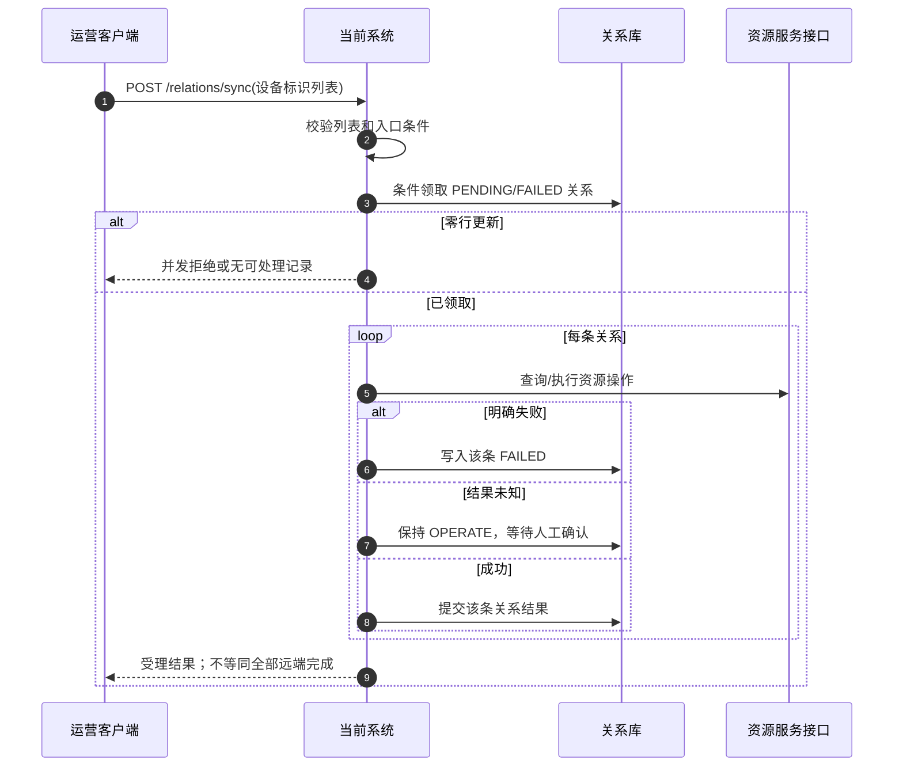
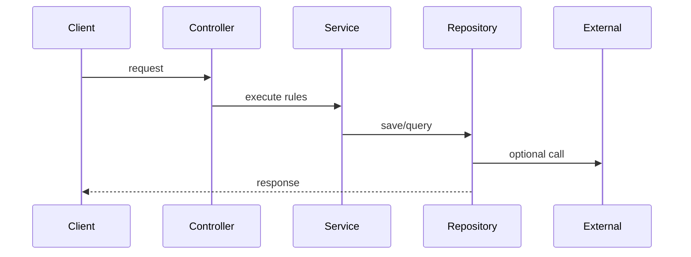

# Examples

## 合格：批量关系同步入口

### 入口说明

`POST /relations/sync` 由运营客户端触发，提交设备标识列表。源码先校验列表非空，再条件领取仅处于 `PENDING` 或明确 `FAILED` 的本地关系；领取不到记录时不访问远端。每条记录独立调用可见的资源接口并提交本地关系，单条异常被记录为失败后继续下一条。外部调用抛出但结果未知时，记录保持 `OPERATE`，等待人工核对；这不是明确失败，也没有源码证据证明会自动重试。

### 业务流程



### 异常与证据

| 条件 | 结果 | 证据 |
| --- | --- | --- |
| 条件领取零行 | 不访问资源服务，调用方收到并发/无可处理结果 | `relation_service.py:41` |
| 单条资源异常被捕获 | 该条失败并继续批次 | `relation_service.py:58` |
| 超时或连接断开，结果未知 | 本地保持 `OPERATE`，人工确认；无自动重放 | `relation_service.py:63` |

图、正文和异常表必须由同一入口事实生成；若源码没有成功返回或补偿证据，标注 `代码中未确认`，不要补画成功分支。

## 不合格：通用分层概览



这张图不能替代入口设计：它没有绑定路由/Topic 和处理器，没有区分查询、写入、批次单项失败、条件领取、异步受理或结果未知，也把 Repository 错画成响应方并凭空加入远端调用。只有逐入口核验调用顺序、参与方、错误后果和证据后，才能生成主图。

## 模块清单对照

`discover` 首次生成的 `business-flow-modules-draft.json` 只代表候选，不是完成结论：

```json
{
  "confirmed": false,
  "modules": [
    {"name": "relation-sync", "entry_ids": ["url:POST /relations/sync"], "questions": ["确认与资源查询是否同一业务边界"]},
    {"name": "notification", "entry_ids": ["message:relation-failed"], "questions": ["确认消息消费是否独立模块"]}
  ]
}
```

人工确认后的 `business-flow-modules.json` 固定同一入口只能有一个主归属，并补齐稳定文件和边界：

```json
{
  "confirmed": true,
  "migrations": [{"from": "resource", "to": "relation-sync", "reason": "按关系生命周期拆分"}],
  "modules": [
    {"name": "relation-sync", "file": "00-relation-sync.md", "responsibility": "关系领取与远端同步", "objects": ["Relation"], "partners": ["资源服务"], "entry_ids": ["url:POST /relations/sync"]},
    {"name": "notification", "file": "01-notification.md", "responsibility": "失败事件通知", "objects": ["FailureEvent"], "partners": ["消息系统"], "entry_ids": ["message:relation-failed"]}
  ]
}
```

确认后生成 `00-relation-sync.md` 和 `01-notification.md`，每个文件仍分别保留入口章节和主时序图；跨模块调用只作为引用，不复制第二个入口。
