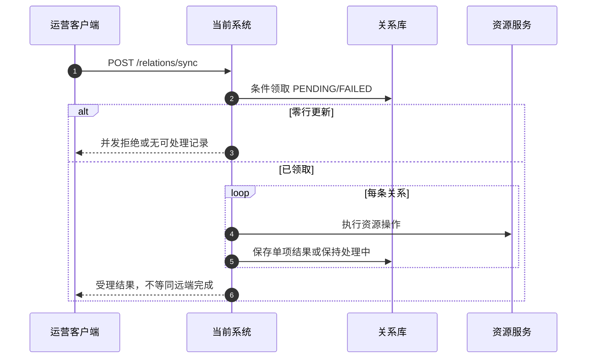

# Relation Sync 流程设计

> 这是可追溯示例；真实生成文件会替换示例指纹和证据位置。

## POST /relations/sync

运营客户端提交设备标识列表。系统先校验输入，再条件领取 `PENDING` 或明确失败的关系；领取不到记录时不访问资源服务。每条关系独立处理，明确失败写入单项失败并继续；远端结果未知时保持处理中，等待人工确认。

证据：`relation_service.py:40-68`。远端内部实现不可见，不展开远端表或事务。
