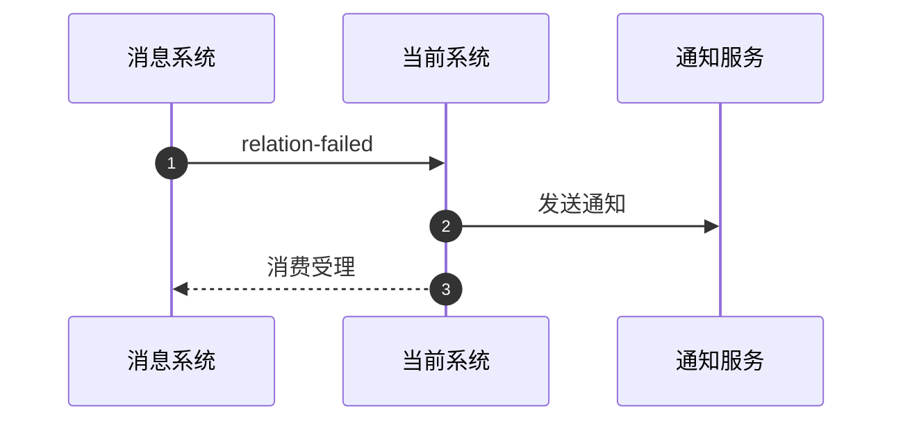

# Notification 流程设计

## relation-failed 消息

消息系统投递关系失败事件。当前系统消费消息并提交通知动作；同步受理和后台工作线程终态分开记录，源码没有确认的重试或 DLQ 不补画。

```mermaid
sequenceDiagram
autonumber
participant Broker as 消息系统
participant App as 当前系统
participant Notify as 通知服务
Broker->>App: relation-failed
App->>Notify: 发送通知
App-->>Broker: 消费受理
```

证据：`notification.py:18-24`。通知服务内部实现不可见。
